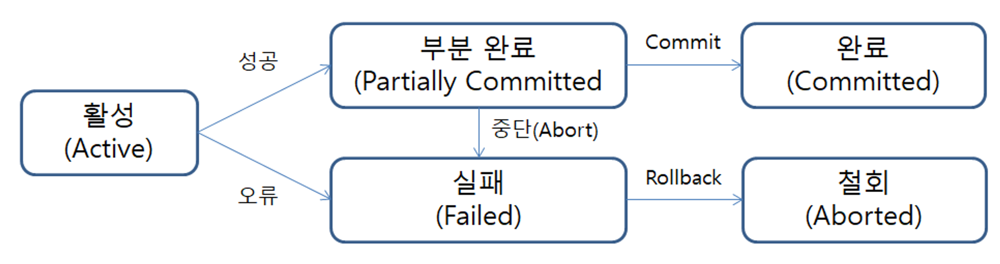

# Mysql note - Transaction

트랜잭션

## Table of Contents

- [트랜잭션이란?](#트랜잭션이란?)
- [트랜잭션 특징](#트랜잭션-특징)
- [트랜잭션 연산](#트랜잭션-연산)
- [트랜잭션 상태](#트랜잭션-상태)

## 트랜잭션이란?

DB의 상태를 변경시키는 여러 작업의 단위

## 트랜잭션 특징

- 원자성 
트랜잭션이 DB에 **모두** 반영 되거나 **아예** 반영되지 않아야 한다.
- 일관성 
트랜잭션 작업 처리 결과는 항상 일관성이 있어야 한다. 
**일관성**?: DB 제약조건에 위배되지 않고 트랜젝션이 반영되어야 한다.
- 독립성 
둘 이상의 트랜잭션이 동시에 병행되어 실행될 때, 서로의 트랜잭션 연산에 침범하지 않는다.
- 지속성 
트랜잭션이 성공적으로 완료됐다면, 결과가 **영구적**으로 반영돼야 한다.

## 트랜잭션 연산

1. COMMIT 연산  
트랜잭션이 **성공**적으로 수행되었음을 선언하는 연산

2. ROLLBACK 연산  
트랜잭션이 **실패**하여 작업을 취소하는 연산

## 트랜잭션 상태

- 활성(active)
  - 트랜잭션이 실행되어 동작중인 상태
- 부분 완료(Partially Committed)
  - COMMIT 이전 SQL문이 수행되고 COMMIT만 남겨둔 상태
- 완료(Committed)
  - 트랜잭션 완료 상태
  - 수행된 SQL을 적용하기 위해 COMMIT을 실행한 상태
- 실패(Failed)
  - 트랜잭션이 정상적으로 진행될 수 없는 상태
- 철회(Aborted)
  - 트랜잭션 ROLLBACK 연산이 된 상태
